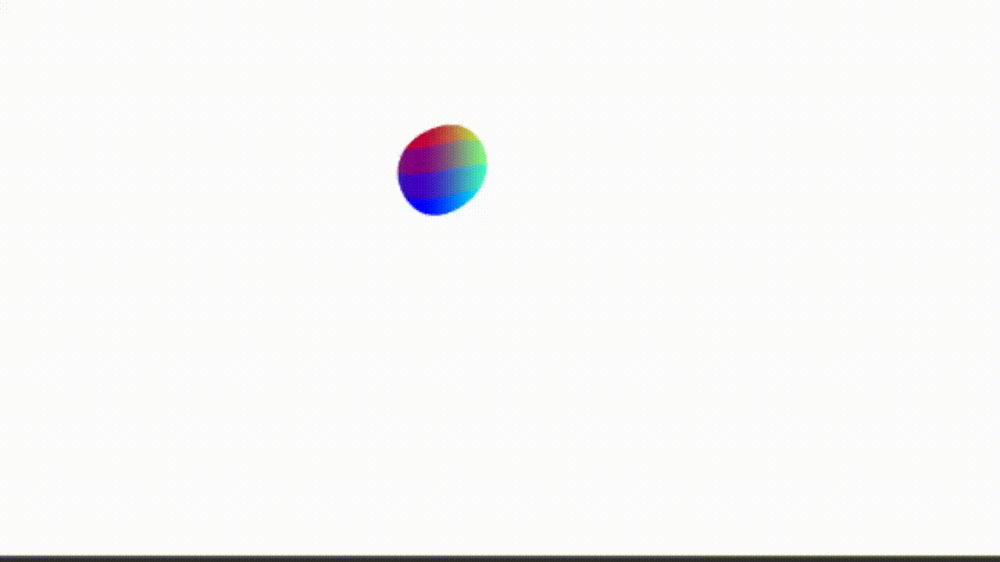

# 🧪 Taller Shaders Básicos con Three.js y React

## 📅 Fecha
`2025-05-15`    

---

## 🎯 Objetivo del Taller

Comprender cómo crear materiales personalizados y efectos visuales en tiempo real usando shaders en Three.js, integrados en una aplicación React con @react-three/fiber. Se exploran técnicas de animación por tiempo, interacción con el usuario y efectos de partículas para simular fenómenos como fuego, agua o portales.

---

## 🧠 Conceptos Aprendidos

- Uso de shaders GLSL (vertex y fragment) en Three.js
- Integración de materiales personalizados con `shaderMaterial` de @react-three/drei
- Animación de materiales usando uniforms y el paso del tiempo
- Respuesta a la entrada del usuario (mouse, voz, etc.)
- Implementación básica de efectos de partículas
- Toon shading y cuantización de la luz

---

## 🔧 Herramientas y Entornos

- React + Vite
- Three.js y @react-three/fiber
- @react-three/drei (shaderMaterial, helpers)
- GLSL para shaders personalizados
- (Opcional) Reconocimiento de voz y entrada de sensores simulados

---

## 📁 Estructura del Proyecto

```
2025-05-15_taller_shaders_basicos_unity_threejs/
└── threejs/
    ├── src/
    │   ├── App.jsx
    │   ├── main.jsx
    │   ├── ShaderSphere.jsx
    │   ├── assets/
    │   │   └── react.svg
    │   └── shaders/
    │       ├── fragmentShader.glsl
    │       └── vertexShader.glsl
    ├── public/
    │   └── vite.svg
    ├── index.html
    ├── package.json
    ├── vite.config.js
    ├── README.md
    └── .gitignore
```

---

## 🧪 Implementación

### 🔹 Etapas realizadas
1. Configuración del entorno React + Vite + Three.js.
2. Creación de un objeto central (esfera) con material personalizado usando shaders GLSL.
3. Animación del material en tiempo real usando uniforms (`uTime`, etc.).
4. Respuesta a la entrada del usuario (ejemplo: movimiento del mouse).
5. Implementación de un sistema básico de partículas para simular efectos visuales.
6. Bonus: Toon shading mediante cuantización de la luz en el fragment shader.

### 🔹 Código relevante

**ShaderSphere.jsx**  
Componente React que crea una esfera con un material personalizado animado:

```jsx
import { useRef } from 'react'
import { useFrame, extend } from '@react-three/fiber'
import { shaderMaterial } from '@react-three/drei'
import vertexShader from './shaders/vertexShader.glsl'
import fragmentShader from './shaders/fragmentShader.glsl'

const MyShaderMaterial = shaderMaterial(
  { uTime: 0 },
  vertexShader,
  fragmentShader
)

extend({ MyShaderMaterial })

export default function ShaderSphere() {
  const ref = useRef()

  useFrame((state) => {
    ref.current.uTime = state.clock.getElapsedTime()
  })

  return (
    <mesh>
      <sphereGeometry args={[1, 64, 64]} />
      <myShaderMaterial ref={ref} />
    </mesh>
  )
}
```

**fragmentShader.glsl**  
Shader de ejemplo con gradiente y animación por tiempo:

```glsl
uniform float uTime;
varying vec3 vPosition;

void main() {
  float gradient = vPosition.y * 0.5 + 0.5;
  float pulse = sin(uTime * 2.0) * 0.5 + 0.5;
  vec3 color = mix(vec3(1.0, 0.2, 0.2), vec3(0.2, 0.2, 1.0), gradient) * pulse;
  gl_FragColor = vec4(color, 1.0);
}
```

**Sistema de partículas básico**  
(Usando Points de drei o tu propio sistema para simular efectos visuales.)

---

## 📊 Resultados Visuales

### Escena con Shader personalizado:




## 💬 Reflexión Final

Este taller permitió experimentar con la creación de materiales y efectos visuales avanzados en Three.js usando shaders personalizados. La integración con React facilita la interacción y la actualización en tiempo real de los parámetros visuales, abriendo la puerta a experiencias interactivas y artísticas en la web.

El uso de shaders permite simular fenómenos complejos y visualmente atractivos, y su combinación con sistemas de partículas amplía las posibilidades creativas. En el futuro, se pueden explorar integraciones con datos en tiempo real, sensores físicos o inteligencia artificial para enriquecer aún más las escenas generadas.

---