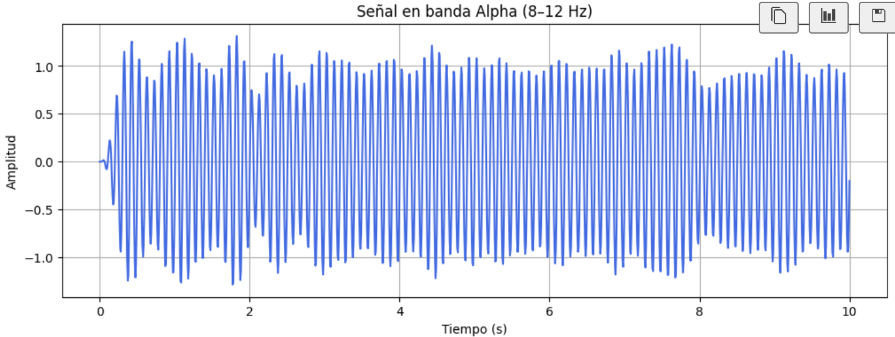

# 🧪 Taller BCI Simulado: Control Visual con Señal EEG

## 📅 Fecha
`2025-05-19`    

---

## 🎯 Objetivo del Taller

Explorar el procesamiento de señales EEG simuladas y su uso para controlar visualizaciones en tiempo real. El taller integra técnicas de filtrado, análisis de potencia en bandas cerebrales y visualización interactiva usando Pygame, simulando un sistema BCI (Brain-Computer Interface).

---

## 🧠 Conceptos Aprendidos

- Carga y preprocesamiento de datos EEG desde archivos CSV
- Filtrado pasa banda con Butterworth para aislar bandas cerebrales (ej. Alpha)
- Cálculo de potencia espectral en bandas de interés usando Welch
- Umbralización y toma de decisiones basada en potencia de banda
- Visualización en tiempo real con Pygame según el estado de la señal
- Integración de procesamiento de señales y visualización interactiva

---

## 🔧 Herramientas y Entornos

- Python 3.12+
- Numpy, Pandas, Matplotlib, Scipy
- Pygame para visualización
- Jupyter Notebook para experimentación y análisis

---

## 📁 Estructura del Proyecto

```
2025-05-19_taller_bci_simulado_control_visual/
├── python/
│   ├── Band_Signal.png
│   ├── datos_eeg.csv
│   └── taller.ipynb
├── README.md
```

---

## 🧪 Implementación

### 🔹 Etapas realizadas
1. Carga de datos EEG simulados desde un archivo CSV.
2. Aplicación de filtro pasa banda (Butterworth) para extraer la banda Alpha (8–12 Hz).
3. Visualización de la señal filtrada con Matplotlib.
4. Cálculo de la potencia en la banda Alpha usando el método de Welch.
5. Definición de un umbral para activar/desactivar una acción visual.
6. Visualización en tiempo real con Pygame: el color de la ventana cambia según la potencia Alpha.

### 🔹 Código relevante

**Carga y filtrado de la señal EEG**
```python
def cargar_datos(csv_path):
    df = pd.read_csv(csv_path)
    tiempo = df['timestamp'].values
    señal = df['eeg'].values
    return tiempo, señal

def butter_bandpass(lowcut, highcut, fs, order=4):
    nyq = 0.5 * fs
    low, high = lowcut / nyq, highcut / nyq
    b, a = butter(order, [low, high], btype='band')
    return b, a

def aplicar_filtro(señal, lowcut, highcut, fs):
    b, a = butter_bandpass(lowcut, highcut, fs)
    return lfilter(b, a, señal)
```

**Cálculo de potencia y visualización**
```python
def calcular_potencia_banda(señal, fs):
    frecs, psd = welch(señal, fs=fs, nperseg=fs*2)
    alpha_band = (frecs >= 8) & (frecs <= 12)
    alpha_power = np.sum(psd[alpha_band])
    return alpha_power

def iniciar_pygame():
    pygame.init()
    ventana = pygame.display.set_mode((600, 400))
    pygame.display.set_caption("Simulación BCI")
    return ventana

def ejecutar_visualizacion(ventana, activo):
    color = (0, 255, 0) if activo else (255, 0, 0)
    ventana.fill(color)
    pygame.display.flip()
```

**Main de integración**
```python
def main():
    ruta_csv = 'datos_eeg.csv'
    fs = 128
    umbral_alpha = 20

    tiempo, señal = cargar_datos(ruta_csv)
    señal_alpha = aplicar_filtro(señal, 8, 12, fs)
    potencia_alpha = calcular_potencia_banda(señal_alpha, fs)
    print(f"Potencia en banda Alpha: {potencia_alpha:.2f}")

    activo = potencia_alpha > umbral_alpha
    ventana = iniciar_pygame()
    ejecutar_visualizacion(ventana, activo)

    while True:
        for evento in pygame.event.get():
            if evento.type == pygame.QUIT:
                pygame.quit()
                sys.exit()

if __name__ == '__main__':
    main()
```

---

## 📊 Resultados Visuales

### Visualización de la señal filtrada:



### Visualización en tiempo real (Pygame):

- **Ventana verde:** potencia Alpha sobre el umbral (activo)
- **Ventana roja:** potencia Alpha bajo el umbral (inactivo)

---

## 💬 Reflexión Final

Este taller permitió comprender el flujo completo de un sistema BCI simulado: desde la adquisición y procesamiento de la señal EEG hasta la toma de decisiones y visualización en tiempo real. La integración de análisis de señales y visualización interactiva sienta las bases para aplicaciones más avanzadas en neurotecnología y control por interfaces cerebro-computadora.

---