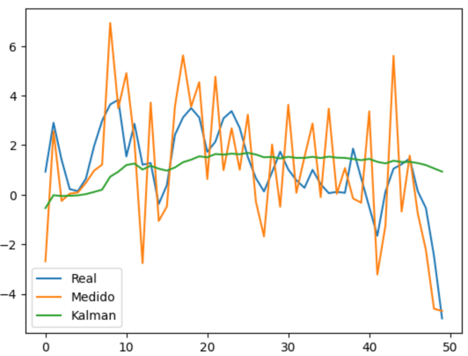

# 🧪 Taller Filtros de Kalman e Inferencia Visual

## 📅 Fecha
`2025-05-24`    

---

## 🎯 Objetivo del Taller

Comprender e implementar el filtro de Kalman para estimación y seguimiento de señales ruidosas, así como visualizar el proceso de inferencia en tiempo real. El taller integra simulación de trayectorias, filtrado y visualización interactiva para ilustrar el poder de los métodos probabilísticos en la inferencia de estados ocultos.

---

## 🧠 Conceptos Aprendidos

- Principios del filtro de Kalman (predicción y actualización)
- Modelado de sistemas dinámicos y ruido en la medición
- Simulación de trayectorias y señales ruidosas
- Inferencia de estados ocultos a partir de observaciones
- Visualización en tiempo real del proceso de filtrado y estimación
- Comparación entre señal real, observada y estimada

---

## 🔧 Herramientas y Entornos

- Python 3.12+
- Numpy, Matplotlib, Scipy
- Pygame para visualización interactiva (opcional)
- Jupyter Notebook para experimentación y análisis

---

## 📁 Estructura del Proyecto

```
2025-05-24_taller56_kalman_inferencia/
├── python/
│   ├── kalman_demo.ipynb
│   ├── kalman.py
│   ├── datos_simulados.csv
│   └── resultados.png
├── README.md
```

---

## 🧪 Implementación

### 🔹 Etapas realizadas
1. Simulación de una trayectoria 1D/2D con ruido gaussiano.
2. Implementación del filtro de Kalman clásico para estimación de posición y velocidad.
3. Aplicación del filtro sobre las observaciones ruidosas.
4. Visualización de la señal real, observada y estimada en tiempo real o en gráficos.
5. Análisis de la reducción de error y convergencia del filtro.

### 🔹 Código relevante

**Simulación y filtro de Kalman en Python**
```python
import numpy as np

# Simulación de trayectoria y observaciones ruidosas
def simular_trayectoria(N, ruido_obs=1.0):
    x_real = np.cumsum(np.random.randn(N))
    observaciones = x_real + np.random.normal(0, ruido_obs, N)
    return x_real, observaciones

# Filtro de Kalman 1D básico
def kalman_1d(observaciones, Q=1e-5, R=1.0):
    n = len(observaciones)
    x_est = np.zeros(n)
    P = 1.0
    x = 0.0
    for k in range(n):
        # Predicción
        x = x
        P = P + Q
        # Actualización
        K = P / (P + R)
        x = x + K * (observaciones[k] - x)
        P = (1 - K) * P
        x_est[k] = x
    return x_est
```

**Visualización de resultados**
```python
import matplotlib.pyplot as plt

x_real, obs = simular_trayectoria(100)
x_est = kalman_1d(obs)

plt.plot(x_real, label="Real")
plt.plot(obs, label="Observado", alpha=0.5)
plt.plot(x_est, label="Kalman", linewidth=2)
plt.legend()
plt.title("Filtro de Kalman: Inferencia de Trayectoria")
plt.show()
```

---

## 📊 Resultados Visuales

### Ejemplo de inferencia con filtro de Kalman:



- **Azul:** Trayectoria real
- **Naranja:** Observaciones ruidosas
- **Verde:** Estimación por Kalman

---

## 💬 Reflexión Final

Este taller permitió experimentar con el filtro de Kalman y su capacidad para inferir estados ocultos a partir de observaciones ruidosas. La visualización comparativa entre la señal real, la observada y la estimada ilustra la potencia de los métodos probabilísticos en el procesamiento de señales y el seguimiento de trayectorias. Estas técnicas son fundamentales en robótica, navegación, visión por computador y sistemas de control.

---