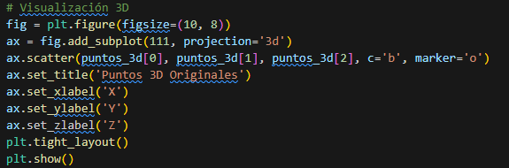
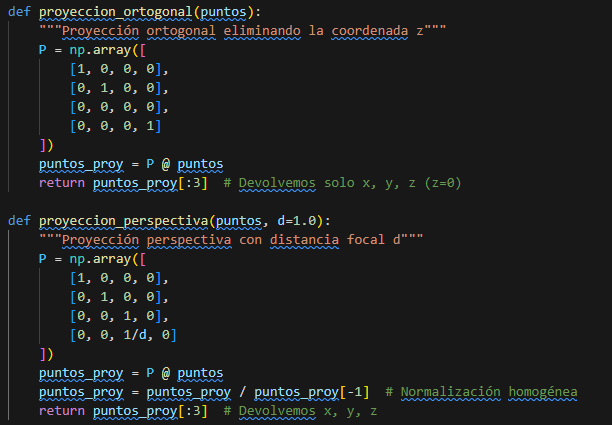
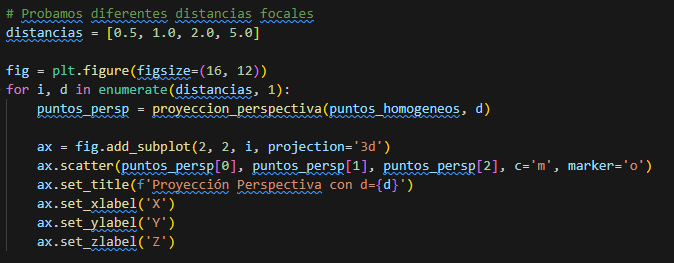
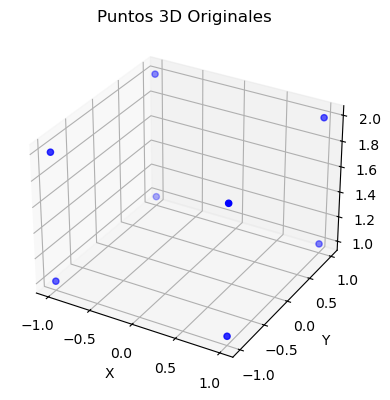
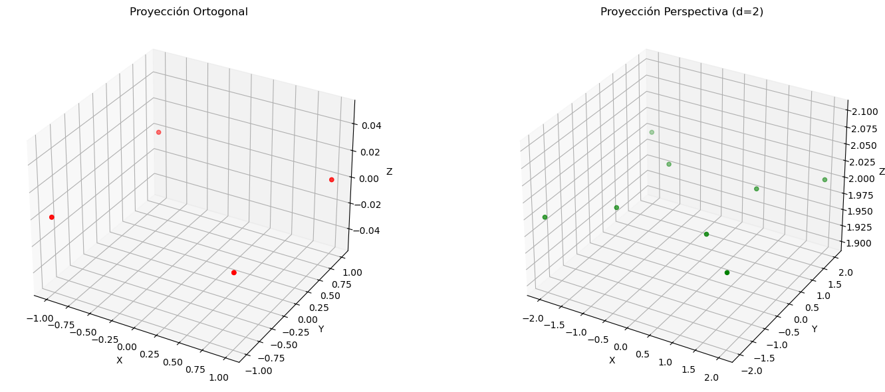
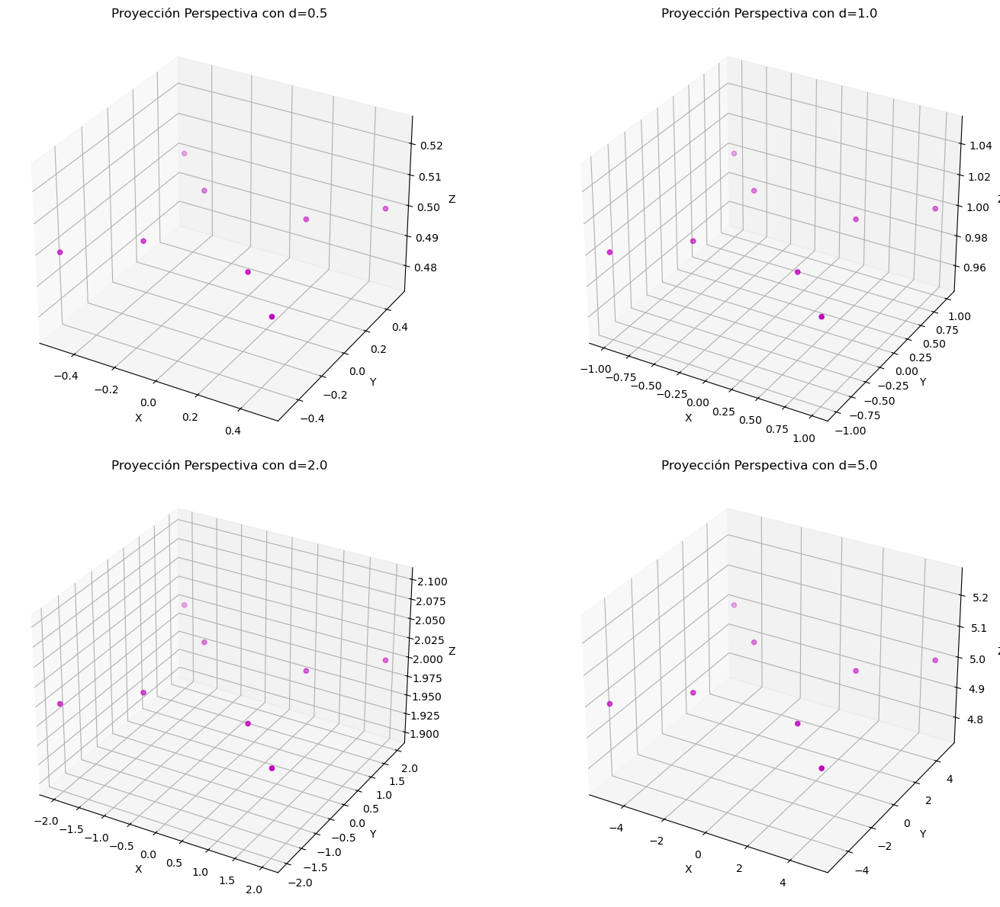
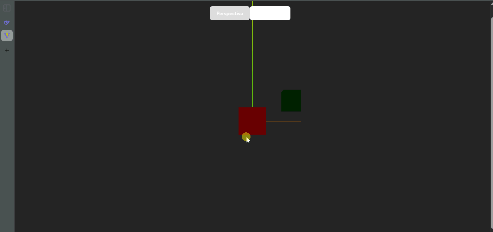

**🧪 Computación Visual \- Espacios Proyectivos y Matrices de Proyección**

**📅 Fecha:** 26/05/2025

**🎯 Objetivo del Taller**

Comprender y aplicar los conceptos fundamentales de geometría proyectiva y el uso de matrices de proyección para representar escenas tridimensionales en un plano bidimensional, base esencial del pipeline gráfico moderno.

**🧠 Conceptos Aprendidos**

Representación de puntos 3D con coordenadas homogéneas    
Matrices de transformación proyectiva    
Proyección ortogonal vs. perspectiva    
Efecto de la distancia focal en proyecciones    
Implementación práctica con Three.js y React

**🔧 Herramientas y Entornos**

Python (NumPy, Matplotlib)    
Jupyter Notebook    
Three.js \+ React Three Fiber    
@react-three/drei para controles de cámara    
JavaScript/React para visualización interactiva

**🧪 Implementación**

**🔹 Etapas realizadas**

1\. Modelado matemático de proyecciones    
2\. Implementación en Python para análisis numérico    
3\. Visualización 3D interactiva con Three.js    
4\. Comparación de efectos visuales entre cámaras

🔹 Código relevante

Imagen 1. Código visualización 3D python

Imagen 2. Código matrices de proyecciones

Imagen 3. Código variación distancias focales

**📊 Resultados Visuales**

Imagen 4. Visualización 3D python

Imagen 5. Comparativa proyecciones

Imagen 6. Perspectivas diferentes

Imagen 7. Threejs salida visual

**🧩 Prompts Usados**

“Using Three.js with React Three Fiber  
Create a scene with three objects positioned at different depths.  
Implement an orthographic camera and perspective, with buttons or controls to switch between them.  
Use OrbitControls to allow free navigation around objects.  
Demonstrate how depth perception changes with each camera.”

**💬 Reflexión Final**

El taller permitió evidenciar cómo los fundamentos matemáticos de la geometría proyectiva se materializan en herramientas gráficas modernas. Se constata que la elección entre proyecciones ortográficas y perspectivas no es meramente técnica, sino que responde a necesidades específicas de representación espacial en diferentes contextos visuales.

Al implementar ambas aproximaciones, se reconoce que la proyección perspectiva \-aunque computacionalmente más compleja- ofrece representaciones más intuitivas para el ojo humano, mientras la ortográfica preserva relaciones métricas esenciales. Esta dualidad fundamenta gran parte de los sistemas de visualización contemporáneos, desde CAD hasta motores de videojuegos.

**👥 Contribuciones Grupales**

Cristian Alejandro Beltran Rojas
Edwin Felipe Pinilla Peralta
Javier Santiago Vargas Parra

**✅ Checklist de Entrega**

- [x] Repositorio organizado con la carpeta 2025-05-26\_taller\_espacios\_proyectivos
- [x] README.md con:  
      - [x] Descripción de la implementación.  
      - [x] Imágenes que muestran los resultados.  
      - [x] Capturas  al código relevante.  
      - [x] Descripción de los prompts utilizados.  
      - [x] Reflexión sobre el aprendizaje.  
- [x] Código limpio y bien comentado.  
- [x] Commits descriptivos en inglés, siguiendo buenas prácticas.