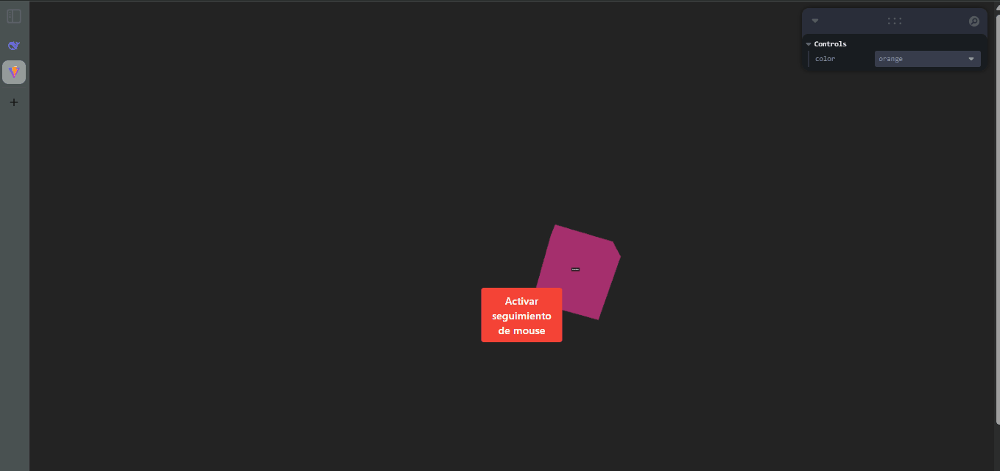

**🧪 Computación Visual \- Entrada del Usuario e Interfaz UI en Three.js**

**📅 Fecha:** 26/05/2025

**🎯 Objetivo del Taller**

Implementar elementos 3D interactivos con controles de entrada (mouse, teclado y selección de objetos) combinados con interfaces UI dinámicas usando Three.js en un entorno React.

**🧠 Conceptos Aprendidos**

* Gestión de escenas Three.js mediante @react-three/fiber  
    
* Manejo de entradas de usuario:  
    
* Seguimiento del mouse con useFrame

* Selección de objetos mediante eventos onClick

* Controles por teclado con useEffect \+ event listeners  
    
* Integración de UI:

* UI embebida en 3D con Html de @react-three/drei

* Paneles de control usando Leva

**🔧 Herramientas y Entornos**

threejs (v0.155.0)

@react-three/fiber (v8.15.1)

@react-three/drei (v9.96.3)

Leva (v0.9.35)

Entorno de desarrollo: Vite \+ React

**🧪 Implementación**

**🔹 Etapas realizadas**

* Configuración de escena 3D:  
  * Creación de un contenedor Canvas responsive  
  * Iluminación (ambiental \+ direccional)  
  * Cubo rotativo con seguimiento al mouse

* Sistemas de entrada:  
  * Mouse: Seguimiento de posición y detección de clicks  
  * Teclado: Reset ('R') y movimiento (teclas direccionales)  
  * Efectos hover con cambio de cursor

* Integración UI:  
  * Botones HTML superpuestos con \<Html\>  
  * Controles Leva para ajuste de parámetros en tiempo real

🔹 Código relevante

Imagen 1\. Control por teclado

Imagen 2\. Animación usando mouse

**📊 Resultados Visuales**

**🧩 Prompts Usados**

"Modify the default App.jsx file to:  
Render a @react-three/fiber \<Canvas\> with basic settings (camera at \[0, 0, 5\], ambient lights).  
Import and display the Scene3D component within the Canvas.  
Include UIOverlay as a sibling element in the Canvas (for traditional HTML UI).  
Ensure the viewport fills the entire screen (width: 100vw, height: 100vh)."

"Create a Scene3D.jsx component in /src/components/ that:

Uses useFrame to automatically rotate a 3D cube and follow the mouse when it's active.  
Implement onClick on the mesh to toggle an isActive state (changes color between 'orange' and 'hotpink').  
Control movement with the keyboard:  
R key resets the position to \[0, 0, 0\].  
Arrows move the cube in X/Y.  
Use drei Html to display a hover label with the state (Active/Inactive).  
Expose a rotationSpeed ​​property for external control from Cam."

"Create a UIOverlay.jsx component in /src/components/ that:

Uses Cama to create a control panel with:  
Slider rotationSpeed ​​(range 0 to 0.1, step 0.001).  
Color picker (options: \['orange', 'hotpink', 'lightblue'\]).  
Reset Position button that emits an event.  
Use drei Html to overlay a traditional HTML button that toggles mouse tracking.  
All controls must communicate with Scene3D via props or context."

**💬 Reflexión Final**

El taller permitió explorar la integración fluida entre interacciones 3D y UI en tiempo real, evidenciando cómo herramientas como R3F y Leva simplifican el desarrollo de experiencias inmersivas. La combinación de controles físicos (mouse/teclado) con elementos visuales superpuestos demuestra el potencial de Three.js para crear aplicaciones interactivas complejas con código modular.

Como aprendizaje clave, se destacó la importancia de entender el flujo de contexto en React para Three.js, especialmente al gestionar hooks dentro del componente Canvas. Los resultados reflejan que, con una arquitectura bien organizada, es posible mantener un equilibrio óptimo entre interactividad y rendimiento.

**👥 Contribuciones Grupales**

Cristian Alejandro Beltran Rojas
Edwin Felipe Pinilla Peralta
Javier Santiago Vargas Parra

**✅ Checklist de Entrega**

- [x] Repositorio organizado con la carpeta 2025-05-26\_taller\_input\_ui  
- [x] README.md con:  
      - [x] Descripción de la implementación.  
      - [x] Imágenes que muestran los resultados.  
      - [x] Capturas  al código relevante.  
      - [x] Descripción de los prompts utilizados.  
      - [x] Reflexión sobre el aprendizaje.  
- [x] Código limpio y bien comentado.  
- [x] Commits descriptivos en inglés, siguiendo buenas prácticas.

