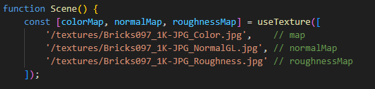
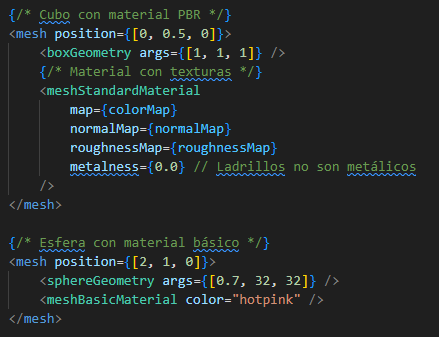
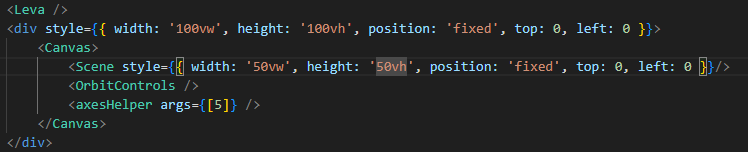
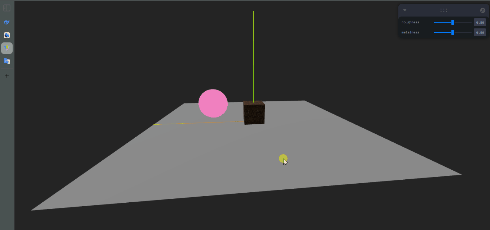

**🧪 Computación Visual \- Materiales Realistas: Introducción a PBR en Three.js**

**📅 Fecha:** 26/05/2025

**🎯 Objetivo del Taller**

Explorar los fundamentos del Physically-Based Rendering (PBR) en Three.js, implementando materiales realistas mediante texturas PBR (map, normal, roughness, metalness) y controles interactivos. Se analizará cómo estas técnicas simulan interacciones físicas de la luz para lograr mayor realismo en modelos 3D.  

**🧠 Conceptos Aprendidos**

* PBR (Physically-Based Rendering): Técnica de renderizado que simula el comportamiento físico de la luz en diferentes materiales.  
    
* Texturas PBR: Uso de mapas de color (color map), normales (normal map), rugosidad (roughness map) y metalicidad (metalness map) para definir las propiedades superficiales de los objetos.  
    
* Controles interactivos: Implementación de un panel de ajustes dinámicos para modificar parámetros como rugosidad y metalicidad en tiempo real.

**🔧 Herramientas y Entornos**

**Three.js \+ React Three Fiber:**   
**Leva**  
**Texturas PBR**

**🧪 Implementación**

**🔹 Etapas realizadas**

* Configuración de la escena básica:  
  * Implementación de luces (AmbientLight y DirectionalLight) para iluminar los objetos.  
  * Creación de geometrías (BoxGeometry, SphereGeometry y PlaneGeometry) para representar los objetos 3D.

* Carga y aplicación de texturas PBR:  
  * Asignación de texturas a los materiales utilizando MeshStandardMaterial.  
  * Comparación entre materiales con texturas PBR y materiales básicos (MeshBasicMaterial).

* Integración de controles interactivos:  
  * Uso de Leva para ajustar parámetros como rugosidad y metalicidad en tiempo real.

🔹 Código relevante

Imagen 1. Importación imagenes para textura

Imagen 2. Generación de figuras geometricas con texturas

Imagen 3. Visualización de objetos 3D con textura

**📊 Resultados Visuales**

Imagen 4. Comprobación de funcionamiento del resultado del taller

**🧩 Prompts Usados**

“Objective:  
Create a replicable example with React Three Fiber that demonstrates:

Basic scene setup (lights, geometries, PBR materials).  
Using PBR textures (map, normalMap, roughnessMap, metalnessMap).  
Interactive controls with Leva.

Technical Requirements:  
✅ React Three Fiber (@react-three/fiber).  
✅ Three.js (geometries, materials, lights).  
✅ PBR textures (.jpg/.png files).  
✅ Control panel with Leva (@react-three/leva).

Implementation Details:  
1\. Basic Scene  
Lights:  
AmbientLight (intensity: 0.3).  
DirectionalLight (position: \[5, 5, 5\], intensity: 1).  
Geometries:  
Floor: PlaneGeometry (size: \[10, 10\]), rotated in X (-Math.PI/2).  
Object 1: BoxGeometry (PBR material with textures).  
Object 2: SphereGeometry (MeshBasicMaterial basic material for comparison).  
2\. PBR Materials and Textures  
MeshStandardMaterial or MeshPhysicalMaterial for the cube:  
Load textures from files:  
map (base color).  
normalMap (surface details).  
roughnessMap and metalnessMap (PBR properties).  
MeshBasicMaterial for the sphere (solid color).  
3\. Cam Controls  
Cam Panel for dynamic adjustment:  
roughness (range: 0 to 1).  
metalness (range: 0 to 1).  
4\. Extras  
OrbitControls for moving the camera.  
Reference axes (axesHelper).  
Clear position of objects (e.g., cube at \[0, 0.5, 0\], sphere at \[2, 1, 0\]).”

**💬 Reflexión Final**

La implementación de texturas PBR permitió transformar objetos 3D simples en modelos visualmente ricos y realistas. A través de la combinación de mapas de normales, rugosidad y metalicidad, se logró simular una amplia variedad de materiales, desde superficies metálicas hasta objetos orgánicos. Este enfoque demostró cómo pequeños detalles en las texturas pueden generar grandes diferencias en la percepción visual.

La integración de controles dinámicos mediante Leva facilitó la experimentación y el ajuste fino de los parámetros de los materiales. Esta capacidad de modificar propiedades en tiempo real no solo mejoró la comprensión de los conceptos teóricos, sino que también permitió explorar rápidamente diferentes configuraciones para lograr los efectos deseados. La interactividad se convirtió en una herramienta invaluable para el aprendizaje y la iteración creativa.

**👥 Contribuciones Grupales**

Cristian Alejandro Beltran Rojas
Edwin Felipe Pinilla Peralta
Javier Santiago Vargas Parra

**✅ Checklist de Entrega**

- [x] Repositorio organizado con la carpeta 2025-05-26\_taller\_materiales\_pbr\_unity\_threejs  
- [x] README.md con:  
  - [x] Descripción de la implementación.  
  - [x] Imágenes que muestran los resultados.  
  - [x] Capturas  al código relevante.  
  - [x] Descripción de los prompts utilizados.  
  - [x] Reflexión sobre el aprendizaje.  
- [x] Código limpio y bien comentado.  
- [x] Commits descriptivos en inglés, siguiendo buenas prácticas.