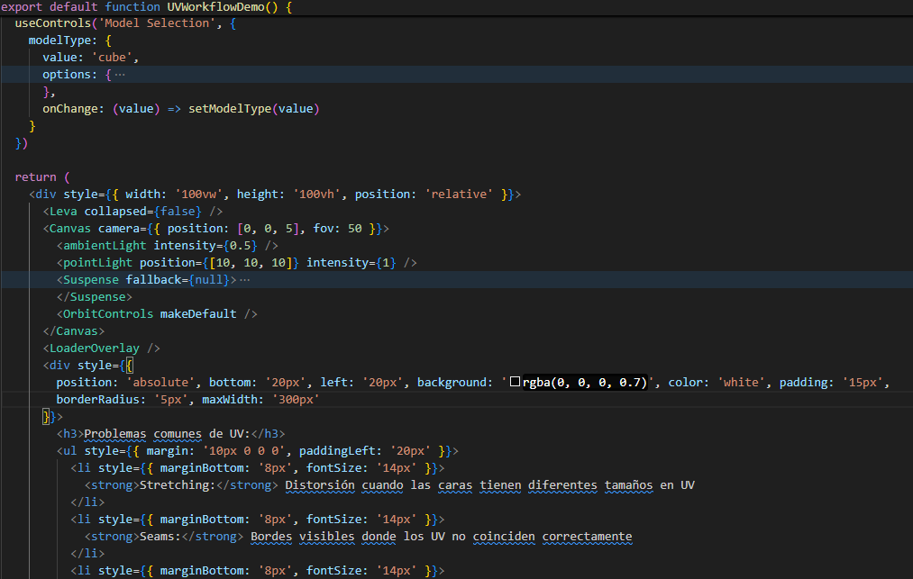

**🧪 Computación Visual \- UV Mapping: Texturas que Encajan**

**📅 Fecha:** 26/05/2025

**🎯 Objetivo del Taller**

Explorar el mapeo UV como técnica fundamental para aplicar correctamente texturas 2D sobre modelos 3D sin distorsión. El objetivo es entender cómo se proyectan las texturas y cómo se pueden ajustar las coordenadas UV para mejorar el resultado visual.

**🧠 Conceptos Aprendidos**

* Mapeo UV: Proyección de texturas 2D en superficies 3D.  
* Coordenadas UV: Sistema que define cómo se "envuelve" la textura en la malla.  
* Distorsiones comunes: Stretching, seams (costuras) y misalignment (desalineación).  
* Parámetros de ajuste: repeat, offset, rotation, wrapS/T.

**🔧 Herramientas y Entornos**

* React Three Fiber (R3F): Biblioteca para 3D en React.  
* @react-three/drei: Utilidades como useGLTF y useTexture.  
* Leva: Panel de controles interactivos.  
* Three.js: Manejo de materiales (MeshStandardMaterial) y geometrías.

**🧪 Implementación**

**🔹 Etapas realizadas**

* Carga de modelos (GLB/GLTF y primitivas como cubo/esfera).  
* Aplicación de texturas (patrón UV checker para diagnóstico).  
* Manipulación dinámica de parámetros UV vía controles interactivos.  
* Visualización de errores en tiempo real.

🔹 Código relevante

Imagen 1. Código clave para estructura visual

**📊 Resultados Visuales**

Imagen 2. Comprobación de código funcional con resultados visuales

**🧩 Prompts Usados**

“Create a hands-on example using React Three Fiber (R3F) that demonstrates the workflow for loading 3D models and applying textures, including UV correction techniques. The code should:

Load a 3D model:

Use useGLTF from @react-three/drei to load a GLTF/OBJ model with predefined UV coordinates  
Include a simple test model (such as a cube, sphere, or plane) and a more complex model (such as a character or organic object)  
Apply textures:  
Use TextureLoader to load a 2D texture (include a UV checker pattern test grid as a texture)  
Apply it using MeshStandardMaterial to visualize how it adapts to the geometry  
UV manipulation:  
Implement controls to dynamically modify:  
texture repeat and offset  
wrapS and wrapT (clamp/repeat/mirror)  
rotation and center (using uvTransform)  
Include a selector to toggle between different models and textures  
Error visualization:  
Clearly show common UV distortions (stretching, seams, misalignment)  
Use the test grid to Highlight problems  
Interface:  
Control panel with dat.GUI or Leva  
Real-time view of the model with orbit controls  
Status messages (loading/error)  
Technical requirements:  
TypeScript  
React Three Fiber v8+  
@react-three/drei  
Optimized models (\<5MB)  
Textures in JPG/PNG format (1024x1024)”

**💬 Reflexión Final**

Este taller nos permitió comprender la importancia crítica del mapeo UV en el proceso de texturizado 3D. A través de la práctica, evidenciamos cómo una correcta asignación de coordenadas UV determina la calidad visual final de los modelos, evitando distorsiones y artefactos. La manipulación dinámica de parámetros como repeat, offset y rotation nos dio control preciso sobre cómo las texturas se adaptan a geometrías complejas.

La experiencia reforzó que el UV mapping no es solo un paso técnico, sino un puente entre el arte 2D y el modelado 3D. Descubrimos que incluso modelos bien construidos pueden verse arruinados por un mapeo UV deficiente, mientras que una buena disposición de UVs puede realzar dramáticamente el realismo. Estas habilidades son fundamentales para cualquier pipeline de producción 3D profesional.

**👥 Contribuciones Grupales**

Cristian Alejandro Beltran Rojas  
Edwin Felipe Pinilla Peralta  
Javier Santiago Vargas Parra

**✅ Checklist de Entrega**

- [x] Repositorio organizado con la carpeta 2025-05-26\_taller\_uv\_mapping\_texturas  
- [x] README.md con:  
      - [x] Descripción de la implementación.  
      - [x] Imágenes que muestran los resultados.  
      - [x] Capturas  al código relevante.  
      - [x] Descripción de los prompts utilizados.  
      - [x] Reflexión sobre el aprendizaje.  
- [x] Código limpio y bien comentado.  
- [x] Commits descriptivos en inglés, siguiendo buenas prácticas.