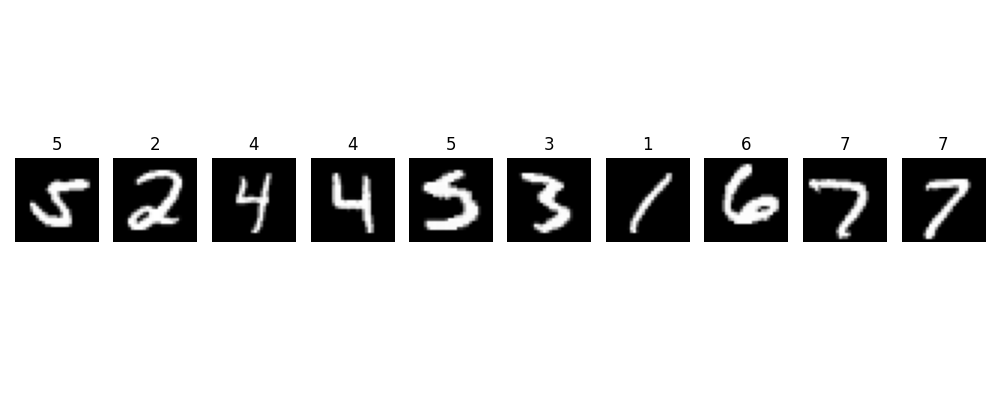

# Taller - Redes Convolucionales desde Cero: Reconocimiento de Imágenes con PyTorch

## 🧠 Objetivo
Construir, entrenar y evaluar un modelo de red neuronal convolucional (CNN) desde cero usando PyTorch, aplicándolo sobre el dataset MNIST para clasificación de dígitos escritos a mano.

---

## 📦 Dataset utilizado
**MNIST** – Contiene 60,000 imágenes de entrenamiento y 10,000 de prueba, en escala de grises (28x28 píxeles), con etiquetas del 0 al 9.

---
A continuación se muestra una muestra aleatoria de 10 imágenes del set de entrenamiento:

## 🧱 Arquitectura de la Red CNN

Conv2D (1 → 32 filtros, kernel 3x3) → ReLU → MaxPooling (2x2)
→ Conv2D (32 → 64 filtros, kernel 3x3) → ReLU → MaxPooling (2x2)
→ Flatten → Fully Connected (128 neuronas) → ReLU → Output (10 clases)

## ⚙️ Entrenamiento del modelo

- **Función de pérdida:** `CrossEntropyLoss`
- **Optimizador:** `Adam`
- **Épocas:** *5*
- **Batch size:** 64

### 📈 Curvas de entrenamiento

*(pytorch/training_curves.png)*

---

## 🧪 Evaluación del modelo

-Número de épocas: 5

-Precisión final (train): ≈ 98%

-Tiempo de entrenamiento: unos pocos segundos por época en CPU.

## Reflexión

Durante este taller aprendí cómo las capas convolucionales extraen características espaciales en imágenes y cómo su combinación con funciones de activación y pooling mejora el desempeño del modelo.

Cambios como aumentar filtros o añadir Dropout pueden aumentar precisión o reducir sobreajuste.