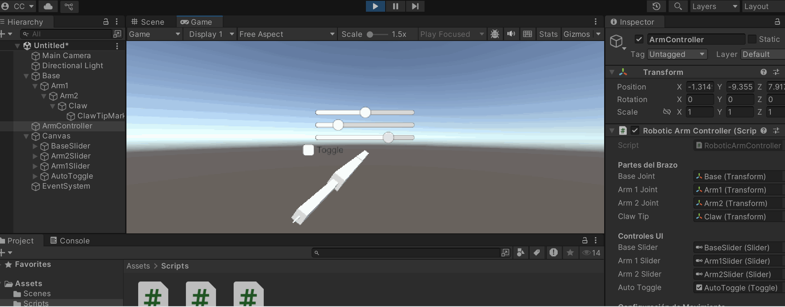

# 🧪 Cinemática Directa: Animando Brazos Robóticos o Cadenas Articuladas

---

## 🎯 (Parte 1) cinemática directa y cómo se implementó.

**¿Qué es la Cinemática Directa (Forward Kinematics)?**
La cinemática directa (FK) es un método para calcular la posición y orientación de un sistema articulado (como un brazo robótico o un esqueleto humano) a partir de los ángulos de sus articulaciones. En esencia:

- Partes rígidas (huesos/segmentos) conectadas por articulaciones (rotacionales o prismáticas).

- Cada articulación afecta la posición de los elementos subsiguientes en la cadena.

- El movimiento se calcula desde la base hasta el extremo (ej.: hombro → codo → mano).
---

## 🧠 (Parte 2) GIFs animados

> ✅ En el siguiente GIF se ve el movimiento en Unity como un braso para moverce y doblarse y doblar el antebrazo 



---

## 🔧 (Parte 3) Código relevante (C#, JSX/GLSL o JS para geometría).

A continuación se muestra el código para el movimiento. 

```C#
using UnityEngine;
using UnityEngine.UI;

public class RoboticArmController : MonoBehaviour
{
    [Header("Partes del Brazo")]
    public Transform baseJoint;    // Rota en el eje Y
    public Transform arm1Joint;    // Rota en el eje X
    public Transform arm2Joint;    // Rota en el eje X
    public Transform clawTip;      // Usado para línea de depuración + marcador

    [Header("Controles UI")]
    public Slider baseSlider;
    public Slider arm1Slider;
    public Slider arm2Slider;
    public Toggle autoToggle;

    [Header("Configuración de Movimiento")]
    public float autoSpeed = 1.5f;       // Velocidad de la onda senoidal
    public float autoAmplitude = 45f;    // Amplitud máxima en grados

    private void Update()
    {
        if (autoToggle.isOn)
        {
            AplicarMovimientoAutomatico();
        }
        else
        {
            AplicarRotacionManual();
        }

        DibujarLineasDebug();
    }

    void AplicarRotacionManual()
    {
        baseJoint.localRotation = Quaternion.Euler(0f, baseSlider.value, 0f);
        arm1Joint.localRotation = Quaternion.Euler(arm1Slider.value, 0f, 0f);
        arm2Joint.localRotation = Quaternion.Euler(arm2Slider.value, 0f, 0f);
    }

    void AplicarMovimientoAutomatico()
    {
        float valorSin = Mathf.Sin(Time.time * autoSpeed);

        baseJoint.localRotation = Quaternion.Euler(0f, valorSin * autoAmplitude, 0f);
        arm1Joint.localRotation = Quaternion.Euler(valorSin * autoAmplitude, 0f, 0f);
        arm2Joint.localRotation = Quaternion.Euler(valorSin * autoAmplitude * 0.5f, 0f, 0f);
    }

    void DibujarLineasDebug()
    {
        Debug.DrawLine(baseJoint.position, arm1Joint.position, Color.red);
        Debug.DrawLine(arm1Joint.position, arm2Joint.position, Color.green);
        Debug.DrawLine(arm2Joint.position, clawTip.position, Color.blue);
    }
}

```

---
## 💻 Reflexión: ¿Animando Brazos Robóticos?

La animación realista de brazos requiere emular la coordinación entre rotaciones y traslaciones articulares. Soluciones como IK, curvas de interpolación y restricciones físicas mejoran significativamente el resultado frente a enfoques puramente trigonométricos

----