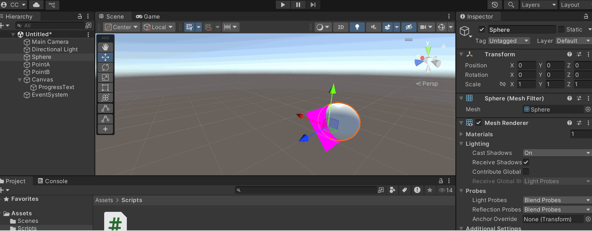

# 🧪 Interpolación de Movimiento: Suavizando Animaciones en Tiempo Real

---

## 🎯 (Parte 1) Explicación de los métodos de interpolación utilizados.
Vector3.Lerp() - Interpolación Lineal de Posiciones
¿Qué es?
Vector3.Lerp() es un método que calcula un punto intermedio entre dos posiciones en el espacio 3D (representadas como Vector3) basado en un factor de interpolación.

Cómo funciona:

Recibe tres parámetros: la posición inicial, la posición final y un valor entre 0 y 1 que indica el progreso de la interpolación.Con valor 0 devuelve exactamente la posición inicial.Con valor 1 devuelve exactamente la posición final.Con valores intermedios (ej. 0.5) devuelve un punto proporcional entre ambas posiciones.

Casos de uso típicos:

- Movimiento suave de objetos entre puntos

- Transiciones de cámara

- Animaciones programáticas simples

- Efectos de desplazamiento gradual

Características importantes:

- Sigue una trayectoria lineal recta entre los puntos

- El movimiento no tiene aceleración/deceleración natural (a menos que se modifique el factor de interpolación)

- Es computacionalmente eficiente

Quaternion.Slerp() - Interpolación Esférica de Rotaciones
¿Qué es?
Quaternion.Slerp() calcula una rotación intermedia entre dos orientaciones (representadas como quaterniones) usando interpolación esférica, que mantiene una velocidad angular constante.

Cómo funciona:

Similar a Lerp, recibe rotación inicial, rotación final y factor de interpolación (0 a 1).La interpolación sigue el arco más corto en la esfera de rotaciones 4D (quaterniones).Mantiene mejor las propiedades de los quaterniones que una interpolación lineal.

Casos de uso típicos:

- Rotación suave de cámaras

- Transiciones entre vistas

- Animación de articulaciones

- Movimientos orbitales o de seguimiento

- Características importantes:

- Proporciona resultados más naturales para rotaciones que Lerp

- Más costoso computacionalmente que Quaternion.Lerp()

**Comparación entre ambos métodos**

Similitudes:

-Ambos interpolan entre dos valores (posición/rotación)

-Usan el mismo esquema de parámetros (inicio, fin, factor)

-Producen movimientos suaves y controlados


---

## 🧠 (Parte 2) GIFs animados

> ✅ En el siguiente GIF se ve el movimiento en Unity como si fuera una barra de carga suavemente llevada.



---

## 🔧 (Parte 3) Código relevante (C#, JSX/GLSL o JS para geometría).

A continuación se muestra el código para el movimiento. 

```C#
    void Awake()
    {
        // Configura el LineRenderer si existe
        line = GetComponent<LineRenderer>();
        if (line != null && pointA != null && pointB != null)
        {
            line.positionCount = 2;
            line.SetPositions(new Vector3[] { pointA.position, pointB.position });
        }
    }

    void Start()
    {
        startRot = transform.rotation;

        // Calcula dirección sin inclinación vertical (solo eje Y)
        Vector3 direction = pointB.position - pointA.position;
        direction.y = 0;

        if (direction != Vector3.zero)
            targetRot = Quaternion.LookRotation(direction);
        else
            targetRot = transform.rotation;
    }

    void Update()
    {
        float smoothT = curve.Evaluate(t);

        // Movimiento suave
        transform.position = Vector3.Lerp(pointA.position, pointB.position, smoothT);

        // Rotación suave (solo eje Y)
        transform.rotation = Quaternion.Slerp(startRot, targetRot, smoothT);

        // Línea visual en Scene view
        Debug.DrawLine(pointA.position, pointB.position, Color.green);

        // Indicador de progreso
        if (progressText != null)
            progressText.text = Mathf.RoundToInt(t * 100) + "%";
    }
}
```

---
## 💻 Reflexión: ¿qué interpolación fue más fluida o natural en tu experiencia?

Mathf.SmoothStep ofrece una interpolación más fluida que Vector3.Lerp() porque suaviza la aceleración y desaceleración, evitando movimientos bruscos al inicio y al final. Lerp() lineal es más simple, pero puede parecer robótico si no se suaviza con una curva.

---