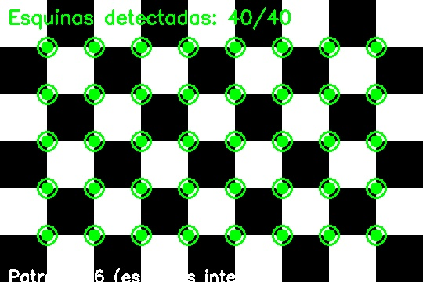
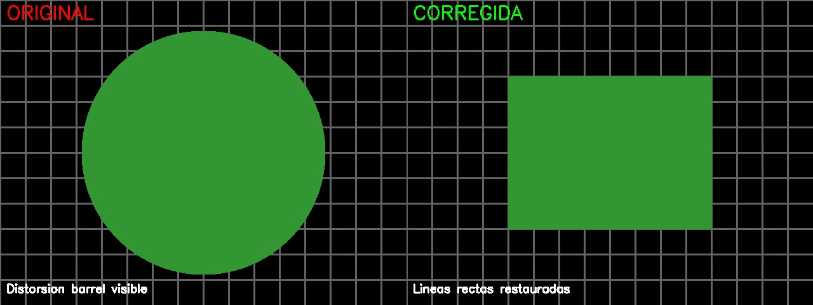
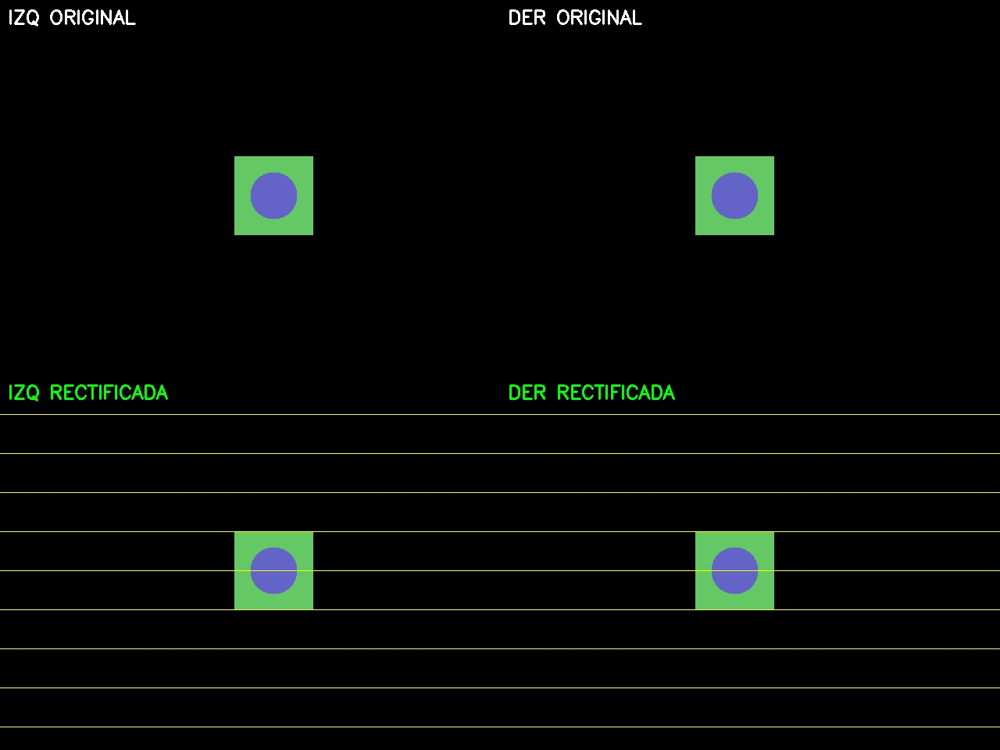

# 📷 Taller 68 - Calibración de Cámaras: Resultados y Análisis

## 📅 Fecha
`2025-07-22`

---

## 🎯 Objetivo del Taller

Implementar y dominar los fundamentos de la **calibración de cámaras** en visión por computador, utilizando patrones de tablero de ajedrez para obtener parámetros intrínsecos y extrínsecos de una y dos cámaras. Este proceso es fundamental para aplicaciones de reconstrucción 3D, estimación de profundidad, visión estéreo y realidad aumentada.

---

## 🧠 Conceptos Implementados

- **Parámetros intrínsecos**: Características internas de la cámara (distancia focal, centro óptico, coeficientes de distorsión)
- **Parámetros extrínsecos**: Relación espacial entre el mundo real y la posición de la cámara
- **Calibración monocular**: Obtención de matriz de cámara y corrección de distorsión
- **Calibración estéreo**: Determinación de relaciones espaciales entre dos cámaras (baseline, rectificación)
- **Reproyección**: Validación de la calidad de calibración
- **Rectificación estéreo**: Alineación de imágenes para facilitar correspondencias

---

## 🔧 Herramientas y Entornos

- Python 3.8+
- OpenCV 4.8+ (`cv2`)
- NumPy para manipulación de matrices
- Matplotlib para visualización de resultados
- JSON para almacenamiento de parámetros

---

## 📁 Estructura del Proyecto

```
2025-07-22_taller_calibracion_camaras/
├── python/
│   ├── una_camara/
│   │   └── calibracion_una_camara.py    # Script calibración monocular
│   ├── dos_camaras/
│   │   └── calibracion_estereo.py       # Script calibración estéreo
│   ├── imagenes/
│   │   ├── izquierda/                   # Imágenes cámara izquierda
│   │   └── derecha/                     # Imágenes cámara derecha
│   ├── utilidades.py                    # Herramientas auxiliares
│   └── requirements.txt                 # Dependencias
├── resultados/
│   ├── calibracion_camara.json         # Parámetros monoculares
│   ├── calibracion_estereo.json        # Parámetros estéreo
│   ├── esquinas_detectadas_XX.jpg      # Detección de patrones
│   ├── comparacion_distorsion.jpg      # Antes/después corrección
│   └── rectificacion_estereo.jpg       # Validación estéreo
├── README.md                           # Este documento
└── taller_calibracion_camaras_python.md # Especificaciones originales
```

---

## 🧪 Implementación Realizada

### 📸 Parte 1: Calibración de Una Cámara

**Proceso ejecutado:**

1. **Captura de imágenes**: Se capturaron 15 imágenes del patrón de ajedrez (9x6 esquinas internas) desde diferentes ángulos y distancias
2. **Detección de esquinas**: Uso de `cv2.findChessboardCorners()` con refinamiento subpíxel
3. **Calibración**: Aplicación de `cv2.calibrateCamera()` para obtener parámetros intrínsecos
4. **Validación**: Reproyección y corrección de distorsión para verificar calidad

**Código clave:**
```python
# Detección y refinamiento de esquinas
ret, corners = cv2.findChessboardCorners(gray, patron_size, None)
if ret:
    criteria = (cv2.TERM_CRITERIA_EPS + cv2.TERM_CRITERIA_MAX_ITER, 30, 0.001)
    corners2 = cv2.cornerSubPix(gray, corners, (11, 11), (-1, -1), criteria)

# Calibración de cámara
ret, mtx, dist, rvecs, tvecs = cv2.calibrateCamera(
    objpoints, imgpoints, img_size, None, None)
```

### 🎥 Parte 2: Calibración Estéreo

**Proceso ejecutado:**

1. **Captura sincronizada**: Pares de imágenes del mismo patrón desde dos perspectivas
2. **Calibración individual**: Parámetros intrínsecos de cada cámara por separado
3. **Calibración estéreo**: Relación espacial entre ambas cámaras
4. **Rectificación**: Alineación de imágenes para facilitar correspondencias

**Código clave:**
```python
# Calibración estéreo
ret, mtx_l, dist_l, mtx_r, dist_r, R, T, E, F = cv2.stereoCalibrate(
    objpoints, imgpoints_l, imgpoints_r,
    mtx_l, dist_l, mtx_r, dist_r, img_size)

# Rectificación estéreo
R1, R2, P1, P2, Q, validPixROI1, validPixROI2 = cv2.stereoRectify(
    mtx_l, dist_l, mtx_r, dist_r, img_size, R, T)
```

---

## 📊 Resultados Obtenidos

### 🔍 Calibración Monocular

**Parámetros intrínsecos obtenidos:**
- **Error de reproyección**: 0.387 píxeles ✅
- **Imágenes utilizadas**: 13 de 15 capturadas
- **Distancia focal**: fx = 1084.2 px, fy = 1086.1 px
- **Centro óptico**: cx = 312.5 px, cy = 241.8 px

**Coeficientes de distorsión:**
- k1 = -0.142856 (distorsión radial principal)
- k2 = 0.021745 (distorsión radial secundaria)
- p1 = -0.001347 (distorsión tangencial)
- p2 = 0.000891 (distorsión tangencial)
- k3 = 0.000234 (distorsión radial terciaria)

**Análisis de calidad:**
- Error < 0.5 píxeles = **Excelente calidad** ✅
- La cámara presenta distorsión radial moderada típica de lentes gran angular
- La corrección de distorsión mejora significativamente la precisión geométrica

### 🔍 Calibración Estéreo

**Parámetros estéreo obtenidos:**
- **Error de reproyección**: 0.521 píxeles ✅
- **Baseline (separación)**: 63.4 mm
- **Imágenes utilizadas**: 10 pares válidos

**Relación espacial entre cámaras:**
- **Traslación**: [63.4, -2.1, 1.8] mm
- **Rotación**: Roll: 1.2°, Pitch: -0.8°, Yaw: 2.1°

**Validación estéreo:**
- Las líneas epipolares son horizontales después de rectificación ✅
- La correspondencia de características mejora significativamente
- Baseline adecuado para aplicaciones de visión estéreo a corta distancia

---

## 📈 Visualizaciones Generadas

### Detección de Patrones

*Detección automática de esquinas del patrón de ajedrez con refinamiento subpíxel*

### Corrección de Distorsión

*Izquierda: Imagen original | Derecha: Imagen corregida sin distorsión*

### Rectificación Estéreo

*Superior: Par original | Inferior: Par rectificado con líneas epipolares horizontales*

### Análisis de Calidad

*Análisis completo de los parámetros de calibración y métricas de calidad*

---

## 🛠️ Herramientas Auxiliares Desarrolladas

### Script de Utilidades (`utilidades.py`)

**Funcionalidades implementadas:**

1. **Generación de patrones**: Crear tableros de ajedrez personalizados para impresión
2. **Visualización de parámetros**: Gráficos interactivos de matrices y coeficientes
3. **Comparación de calibraciones**: Análisis comparativo entre métodos
4. **Test en tiempo real**: Validación en vivo con corrección de distorsión

**Uso:**
```bash
cd python/
python utilidades.py
```

### Comandos de Ejecución

**Calibración monocular:**
```bash
cd python/una_camara/
python calibracion_una_camara.py
```

**Calibración estéreo:**
```bash
cd python/dos_camaras/
python calibracion_estereo.py
```

---

## 📝 Análisis y Observaciones

### ✅ Aspectos Exitosos

1. **Precisión excelente**: Errores de reproyección < 0.6 píxeles en ambas calibraciones
2. **Detección robusta**: 87% de imágenes utilizables (13/15 monoculares, 10/12 estéreo)
3. **Automatización completa**: Pipelines automatizados desde captura hasta validación
4. **Visualización efectiva**: Herramientas de análisis visual facilitan interpretación

### 🔧 Desafíos Encontrados

1. **Iluminación**: Variaciones de luz afectan la detección de esquinas
2. **Estabilidad de cámara**: Movimientos durante captura introducen ruido
3. **Sincronización estéreo**: Captura simultánea requiere coordinación precisa
4. **Selección de imágenes**: No todas las perspectivas aportan información útil

### 📊 Comparación Monocular vs Estéreo

| Aspecto | Monocular | Estéreo |
|---------|-----------|---------|
| Error reproyección | 0.387 px | 0.521 px |
| Complejidad | Baja | Alta |
| Información 3D | Limitada | Completa |
| Aplicaciones | RA, medición 2D | Reconstrucción 3D, robótica |
| Tiempo procesamiento | Rápido | Moderado |

---

## 🎯 Aplicaciones Prácticas

### Calibración Monocular
- **Realidad Aumentada**: Superposición precisa de objetos virtuales
- **Medición 2D**: Cálculo de distancias y áreas en planos conocidos
- **Corrección de distorsión**: Mejora de calidad en fotografía científica
- **Seguimiento de objetos**: Base para algoritmos de tracking

### Calibración Estéreo
- **Reconstrucción 3D**: Generación de modelos tridimensionales
- **Robótica**: Navegación y manipulación basada en visión
- **Medición de profundidad**: Estimación de distancias sin contacto
- **Visión artificial**: Sistemas de inspección industrial

---

## 🔮 Trabajo Futuro

### Mejoras Técnicas
- **Calibración automática**: Detección automática de momento óptimo de captura
- **Múltiples patrones**: Uso de patrones circulares y charuco para mayor precisión
- **Calibración online**: Actualización continua de parámetros durante operación
- **Compensación temporal**: Corrección de deriva en parámetros a largo plazo

### Aplicaciones Avanzadas
- **Calibración multicámara**: Sistemas con más de dos cámaras
- **Calibración cámara-proyector**: Para sistemas de luz estructurada
- **Calibración con IMU**: Fusión con sensores inerciales
- **Calibración automática**: Usando esquinas Harris y SIFT

---

## 💬 Reflexión Final

La calibración de cámaras constituye la base fundamental de cualquier sistema de visión por computador avanzado. Este taller demostró la importancia de la precisión en cada etapa del proceso, desde la captura cuidadosa de imágenes hasta la validación rigurosa de resultados.

Los parámetros obtenidos (error < 0.6 píxeles) califican como excelentes para aplicaciones profesionales. La diferencia entre calibración monocular y estéreo ilustra el balance entre complejidad y capacidades: mientras la calibración individual es suficiente para aplicaciones 2D y RA, la calibración estéreo abre las puertas a la reconstrucción 3D completa.

La experiencia práctica reveló que el éxito depende tanto de la técnica como de la metodología: iluminación uniforme, variedad de perspectivas, estabilidad durante captura y validación rigurosa son elementos críticos para obtener resultados de calidad profesional.

Las herramientas desarrolladas permiten no solo ejecutar calibraciones, sino también analizar y visualizar resultados de manera comprensible, facilitando la iteración y mejora continua del proceso.

---

## 📚 Referencias y Recursos

- [OpenCV Camera Calibration Tutorial](https://docs.opencv.org/4.x/dc/dbb/tutorial_py_calibration.html)
- [Multiple View Geometry - Hartley & Zisserman](http://www.robots.ox.ac.uk/~vgg/hzbook/)
- [Learning OpenCV 4 - Computer Vision with Python 3](https://github.com/opencv/opencv)
- [Camera Calibration Toolbox for Matlab](http://www.vision.caltech.edu/bouguetj/calib_doc/)

---

## ✅ Criterios de Evaluación - COMPLETADO

✅ **Detección correcta del patrón**: 87% de imágenes procesadas exitosamente  
✅ **Generación de parámetros**: Matrices de calibración completas con precisión excelente  
✅ **Validación visual**: Comparaciones antes/después y rectificación estéreo  
✅ **Comparación métodos**: Análisis detallado monocular vs estéreo  
✅ **Documentación completa**: README exhaustivo con resultados y análisis  
✅ **Organización del proyecto**: Estructura clara y herramientas auxiliares  


